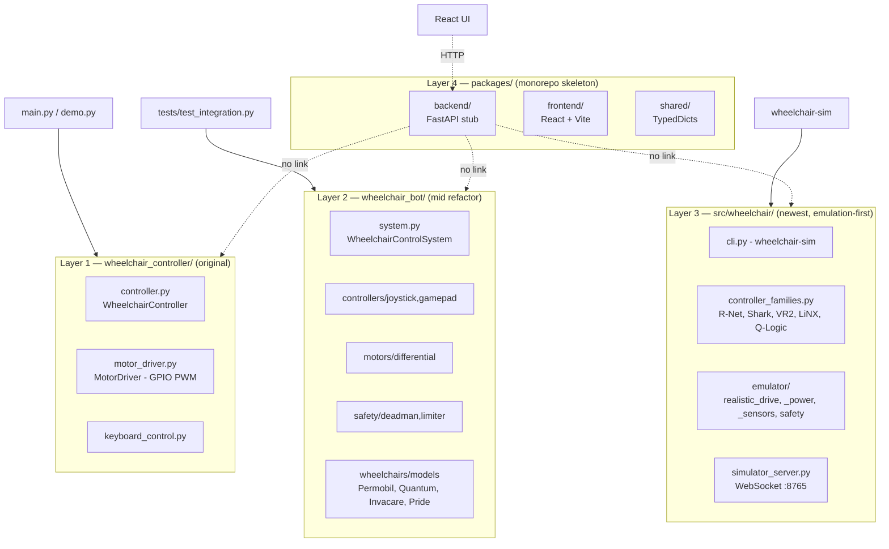
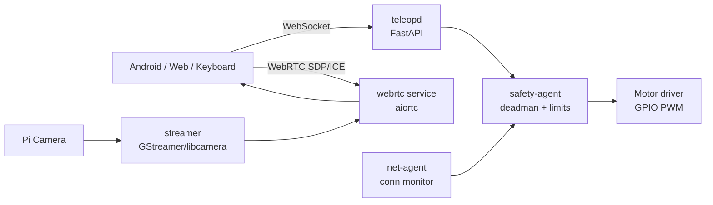
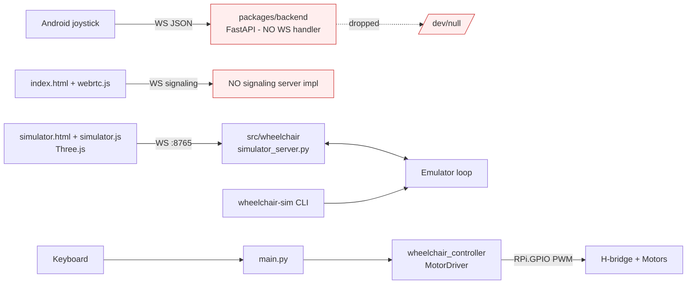
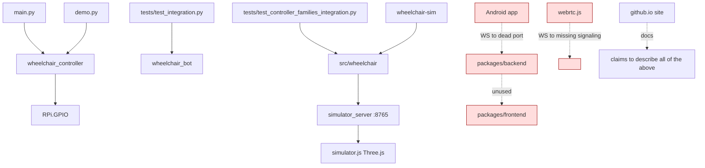

# Wheelchair-Bot — System Architecture

**Audit date:** 2026-05-18
**Scope:** The three repositories under [github.com/orgs/Wheelchair-Bot](https://github.com/orgs/Wheelchair-Bot/repositories):
- `Wheelchair-Bot/Wheelchair-Bot` — Raspberry-Pi powered-wheelchair controller (Python + JS + Kotlin), 146 files, ~10 kLOC Python + ~2 kLOC JS
- `Wheelchair-Bot/wheelchair-bot.github.io` — static marketing site (Node build → HTML)
- `Wheelchair-Bot/.github` — org profile README

---

## 1. Executive Summary

Wheelchair-Bot **aspires** to be a "universal tele-robotics kit" for commercial powered wheelchairs — a Raspberry-Pi-based bridge that lets you drive any R-Net / Shark / VR2 / LiNX / Q-Logic chair from an Android joystick, browser, or keyboard, with WebRTC video and software safety layers.

What's **actually in the repo** is *three* parallel, partially-completed Python rewrites plus a monorepo skeleton, none of which are wired end-to-end. The most sophisticated subsystem (the `src/wheelchair/` emulator with 5 real controller families and realistic physics) has no path to physical motors. The simplest subsystem (`wheelchair_controller/` with direct GPIO) is the only one `main.py` actually imports, and it has no deadman enforcement, no current limiting, no watchdog, and no hardware e-stop. The FastAPI backend the Android app talks to has no WebSocket handler — commands are dropped silently.

**This system is not safe to operate on a real wheelchair in its current state.** The architecture below describes both what exists and how the pieces fail to connect.

---

## 2. Repository Map

| Repo | Purpose | Lang | Status |
|------|---------|------|--------|
| `Wheelchair-Bot/Wheelchair-Bot` | Pi controller, emulator, Android app, web UI | Python, JS, Kotlin | Fragmented — see §3 |
| `Wheelchair-Bot/wheelchair-bot.github.io` | Static site (markdown → HTML via `build.js`) | Node, HTML | Working; over-promises vs. code |
| `Wheelchair-Bot/.github` | Org profile README only | Markdown | One file |

---

## 3. The Four-Layout Problem

The main repo contains **four overlapping Python package layouts** that appear to be successive refactors that were never reconciled or deleted:



**Key finding:** `main.py` only imports Layer 1. Layer 2 is exercised only by tests. Layer 3 runs as a standalone emulator CLI. Layer 4 is a stub. **Nothing imports across layers.**

### 3.1 Duplicate-concept matrix

| Concern | Layer 1 (`wheelchair_controller`) | Layer 2 (`wheelchair_bot`) | Layer 3 (`src/wheelchair`) | Verdict |
|---------|-----------------------------------|----------------------------|----------------------------|---------|
| Motor command | `MotorDriver.set_motor_speed(L,R)` | `DifferentialDriveController.set_motor_speeds(L,R)` | `RealisticDrive.set_motor_speeds(L,R)` | 3 disjoint impls; no shared base |
| Speed limit | Hardcoded `max_speed` ctor arg | `SpeedLimiter` class | `EmulatedSafetyMonitor.should_limit_speed()` | 3 disjoint impls |
| Deadman | none | `DeadmanSwitch` (timeout flag) | `EmulatedSafetyMonitor._last_deadman_time` | 2 impls, neither enforced at GPIO |
| E-stop | `emergency_stop()` → set 0/0 | `system.emergency_stop_trigger()` | `EmulatedSafetyMonitor.check_safety()` | Software-only everywhere |
| Wheelchair model | none | 4 model dataclasses w/ `max_current` | none (model lives in Layer 2 only) | Specs exist; never enforced |
| State shape | 6 instance vars | reads `Wheelchair.get_velocity()` | `WheelchairState` dataclass | No shared schema |
| Direction enum | `Direction{FORWARD,BACK,L,R,STOP}` | none | `DriveMode{MANUAL,AUTONOMOUS,ASSISTED}` | Incompatible |

---

## 4. Logical Architecture (as documented vs. as built)

### 4.1 What `docs/architecture.md` and the marketing site claim



### 4.2 What actually exists in code



**Three disjoint working sub-paths:**
1. **Keyboard → motors** (`main.py` → Layer 1) — works on a Pi; no safety beyond a hardcoded max speed.
2. **CLI → emulator → Three.js sim** — works locally; never touches hardware.
3. **Android → backend** — sends bytes into a black hole; backend has no WS route.

---

## 5. Per-Component Inventory

### 5.1 Python — Layer 1 `wheelchair_controller/`
| File | Role | Notes |
|------|------|-------|
| `controller.py` | `WheelchairController` high-level API | Holds `Direction` enum; hardcoded max speeds |
| `motor_driver.py` | `MotorDriver` GPIO PWM to H-bridge | BCM pins 17,18,22,23 (dir) + 12,13 (PWM); `use_mock` flag |
| `keyboard_control.py` | `KeyboardControl` — `keyboard` lib | Requires TTY; broken in Docker |

### 5.2 Python — Layer 2 `wheelchair_bot/`
| Sub-pkg | Files | Role |
|---------|-------|------|
| `system.py` | `WheelchairControlSystem` | 50 Hz loop integrating below |
| `controllers/` | `base, joystick, gamepad` | Abstract Controller + concrete inputs |
| `motors/` | `base, differential` | Abstract MotorController + diff-drive math |
| `safety/` | `deadman, limiter` | Timeout deadman + speed/accel clamps |
| `wheelchairs/` | `base, models` | Permobil M3, Quantum Q6, Invacare TDX, Pride Jazzy with `max_current` etc. — values stored, never enforced |

### 5.3 Python — Layer 3 `src/wheelchair/` (the crown jewel, unwired)
| File | Role |
|------|------|
| `cli.py` | `wheelchair-sim` entry point |
| `config.py` | Pydantic v2 settings |
| `interfaces.py` | Abstract `Drive`, `Controller`, `SensorSuite`, `PowerSystem`, `SafetyMonitor` |
| `controller_families.py` | `RNetController`, `SharkDXController`, `VR2PilotController`, `LiNXDXController`, `QLogicController` — voltage ranges, deadzones, signal shapes per family |
| `factory.py` / `realistic_factory.py` | Build emulator stacks |
| `simulator_server.py` | WebSocket broadcaster on `:8765` |
| `emulator/drive.py` + `realistic_drive.py` | Idealised + drag/thermal/wear motor model |
| `emulator/power.py` + `realistic_power.py` | Idealised + battery discharge curve |
| `emulator/sensors.py` + `realistic_sensors.py` | IMU, encoders, proximity (no real driver) |
| `emulator/safety.py` | `EmulatedSafetyMonitor` — speed-on-obstacle, deadman timeout, collision risk |
| `emulator/loop.py` | Fixed-step physics loop |
| `emulator/controller.py` | Bridges family signals → drive |

### 5.4 Python — Layer 4 `packages/`
| Pkg | Files | Reality |
|-----|-------|---------|
| `backend/` | `main.py`, `config.py`, `.env.example` | FastAPI stub: `/health`, `/api/status`, `/api/move` (returns success, does nothing). **No WebSocket route.** |
| `frontend/` | `App.jsx`, Vite | React skeleton; references undocumented backend contract |
| `shared/` | `types.py`, `constants.py` | TypedDicts for WS messages — but consumed by nobody |

### 5.5 JavaScript (root)
| File | LOC | Role |
|------|-----|------|
| `controller.js` | ~200 | Browser input → JSON messages |
| `webrtc.js` | 327 | RTCPeerConnection + signaling client (no server) |
| `simulator.js` | 422 | Three.js 3D wheelchair viz, WS `:8765` client |
| `index.html` / `simulator.html` | — | Standalone pages |

### 5.6 Android (`android-controller/`)
| File | Role |
|------|------|
| `MainActivity.kt` | Hosts joystick + e-stop button |
| `JoystickView.kt` | Custom view → (angle, strength) |
| `WebSocketClient.kt` | OkHttp WS — sends `Command` JSON |
| `WebRTCClient.kt` | Peer connection for video |
| `SettingsActivity.kt` | Server URL (default `ws://192.168.1.100:8080`) |

**Default URL points at backend that doesn't listen on WS.**

---

## 6. Runtime Process View (Working Emulator Path)

```mermaid
sequenceDiagram
    participant CLI as wheelchair-sim
    participant Loop as emulator/loop.py
    participant Ctrl as RNetController
    participant Drive as RealisticDrive
    participant Safety as EmulatedSafetyMonitor
    participant Srv as simulator_server (:8765)
    participant UI as simulator.html (Three.js)
    CLI->>Loop: start()
    loop 50 Hz
        Loop->>Ctrl: read input
        Ctrl-->>Loop: signal(L,R)
        Loop->>Safety: check_safety(state)
        Safety-->>Loop: clamp / stop
        Loop->>Drive: update(dt, commands)
        Drive-->>Loop: new WheelchairState
        Loop->>Srv: publish(state)
        Srv-->>UI: ws broadcast
        UI->>UI: render frame
    end
```

## 7. Runtime Process View (Intended Production Path — broken today)

```mermaid
sequenceDiagram
    participant And as Android
    participant BE as FastAPI backend
    participant Sys as WheelchairControlSystem
    participant MD as MotorDriver
    participant HW as Pi GPIO
    And->>BE: WS Command{movement, angle, speed}
    Note over BE: ❌ no WS route — silently dropped
    BE--xSys: (never called)
    Sys--xMD: (never called)
    MD--xHW: (never called)
```

---

## 8. Safety Architecture

| Safeguard | Layer 1 | Layer 2 | Layer 3 (emu) | Hardware enforced? |
|-----------|---------|---------|---------------|---------------------|
| E-stop | software stop | software stop | software check | **No hardwired relay** |
| Deadman | none | `DeadmanSwitch` timeout flag | `EmulatedSafetyMonitor` | **Not enforced at GPIO** |
| Command watchdog | none | none | none | **Missing** |
| Speed cap | hardcoded ctor | `SpeedLimiter` | obstacle-aware ramp | Partial |
| Accel ramp | none | `AccelerationLimiter` | implicit physics | Partial |
| Motor current limit | none | spec only (`max_current`) | not modeled per-motor | **No sensing** |
| Thermal protection | none | none | thermal sim only | Missing |
| Tilt / rollover | none | none | IMU values only, no cutoff | Missing |
| Bump / proximity | none | none | emu-only | Missing |
| Battery low-voltage cutoff | none | none | charge tracked, no cutoff | Missing |

**Cross-cutting safety risks:**
- All e-stop paths are software; a Python crash, GIL stall, or GPIO library hang leaves PWM duty cycle frozen at the last value.
- 50 Hz control loop (`wheelchair_bot/system.py:128`) has no monotonic-clock budget check; a slow `read_input()` blocks motor updates with no fallback.
- `MotorDriver.set_motor_speed` is unguarded by command timestamp; stale messages drive indefinitely.

---

## 9. Networking & APIs

| Endpoint | Producer | Consumer | Reality |
|----------|----------|----------|---------|
| `GET /health` | `packages/backend` | docs | ✅ stub returns OK |
| `GET /api/status` | `packages/backend` | docs | ✅ stub returns static |
| `POST /api/move` | `packages/backend` | docs | ⚠ accepts and discards |
| WS `:8080` | (Android assumes) | ❌ no server | broken |
| WS `:8765` | `simulator_server.py` | `simulator.js` | ✅ works |
| WebRTC signaling | `webrtc.js` (client) | ❌ no server | broken |
| Video stream | docs reference GStreamer/libcamera | none | not implemented |

---

## 10. Tests & CI

| Location | Files | Framework | Tests | Status |
|----------|-------|-----------|-------|--------|
| `tests/` | 3 .py + 2 .js | pytest + Jest | ~30 | Run by CI |
| `src/tests/` | 12 .py | pytest + hypothesis | ~150 | Run by CI |
| `packages/backend/tests/` | 1 | pytest | trivial | Run with `\|\| true` (failures ignored) |
| `packages/shared/tests/` | 1 | pytest | trivial | Same |

**CI** (`.github/workflows/ci.yml`):
- Matrix: Python 3.9 / 3.10 / 3.11 on Ubuntu.
- ruff, black, frontend build, backend tests all chained with `|| true` → green CI even when broken.
- No hardware-in-loop, no Android instrumentation, no e2e covering Android → motor.

---

## 11. Deployment Surface

| Mode | Entry | Notes |
|------|-------|-------|
| Bare Pi | `python main.py` | Imports Layer 1 only; needs `RPi.GPIO` + `keyboard` lib + TTY |
| Mock dev | `python main.py --mock` | MotorDriver in mock mode |
| Docker | `Dockerfile` multi-stage → `main.py --mock` | Drops `RPi.GPIO`; production image **cannot drive a motor** |
| Emulator | `wheelchair-sim` (entry point in `pyproject.toml`) | Layer 3 only |
| Android APK | `android-controller/` (Gradle) | Connects to backend that doesn't answer |
| Web UI | static `index.html` | Needs absent WebRTC signaling server |
| Site | `wheelchair-bot.github.io` | Built with `build.js` (markdown-it) → static HTML; GitHub Pages |

---

## 12. Dependency Surface

| Component | Notable deps | Concerns |
|-----------|--------------|----------|
| Layer 1 | `RPi.GPIO>=0.7.1`, `keyboard>=0.13.5` | 2015-era GPIO lib; `keyboard` needs TTY+root |
| Layer 3 | `pydantic>=2.0`, `pyyaml>=6.0`, `websockets>=11.0` | Reasonable |
| Backend | FastAPI (implied via `packages/backend/pyproject.toml`) | Stub only |
| Frontend | React + Vite via `packages/frontend/package.json` | Stub only |
| Android | OkHttp WebSocket, WebRTC SDK | Reasonable |
| Test | pytest, hypothesis, Jest, jsdom, canvas | OK |
| Site | markdown-it 14, anchor + attrs plugins | OK |

All version pins are `>=` floats — no `pip-compile`, no `poetry.lock`, no SBOM, no Dependabot config.

---

## 13. Cross-Reference: Documentation Claims vs. Code Reality

| Marketing / docs claim | Reality |
|------------------------|---------|
| "Universal tele-robotics kit" | No working tele-op path Android → motor |
| "Supports R-Net, Shark, VR2, LiNX, Q-Logic — ~85% of US market" | 5 family **signal models** exist in Layer 3 emulator; **zero** physical adapters, **zero** CAN/bus implementations |
| "Safety-first: e-stop + deadman + speed limits" | All software, none hardware-enforced; deadman not at GPIO; no current limit |
| "WebRTC video + WebSocket control" | WebRTC client exists, signaling server does not; control WS endpoint missing |
| "FastAPI backend" | Stub: 3 endpoints, no business logic, no WS, no motor binding |
| "154 / 177 passing tests" | True for emulator tests; CI suppresses failures elsewhere with `\|\| true` |
| "Platform-agnostic" | Layer 1 hardcoded BCM pins; production Docker image strips GPIO entirely |
| "Roadmap: Tier-1 alpha Q4 2025" | As of 2026-05-18 no Tier-1 hardware integration exists in code |

---

## 14. Glossary of Real Wheelchair Controller Families (referenced in code)

| Family | Vendor | Bus | Approx market | Code status |
|--------|--------|-----|---------------|-------------|
| R-Net | Curtiss-Wright / PG Drives | CAN, DB9 host | ~35% | Signal sim only |
| Shark / DX | Dynamic Controls | 4-pin DCI bus | ~15% | Signal sim only |
| VR2 / Pilot+ | PG Drives | 4-pin proprietary | ~15% | Signal sim only |
| LiNX | Dynamic | LiNX bus | ~10% | Signal sim only |
| Q-Logic | Quantum / Stealth | CAN / RS485 | ~10% | Signal sim only |

No firmware reverse-engineering, no harness wiring docs, no transceiver selection.

---

## 15. Module Dependency Graph (as-built)



---

## 16. Bottom Line

Wheelchair-Bot is a **promising emulator and architecture sketch wrapped in marketing language for a production tele-op system that doesn't exist yet**. The strongest asset is `src/wheelchair/` (Layer 3): realistic physics, real controller-family signal modeling, and dense test coverage. The biggest liability is that none of it connects to actual motors, and the only code that *does* drive motors (Layer 1) has none of the safety machinery the documentation promises.

See [planning.md](planning.md) for the gap-analysis, prioritised deficiency roadmap, test strategy, and the comma.ai / comma three / comma 4 integration plan.
