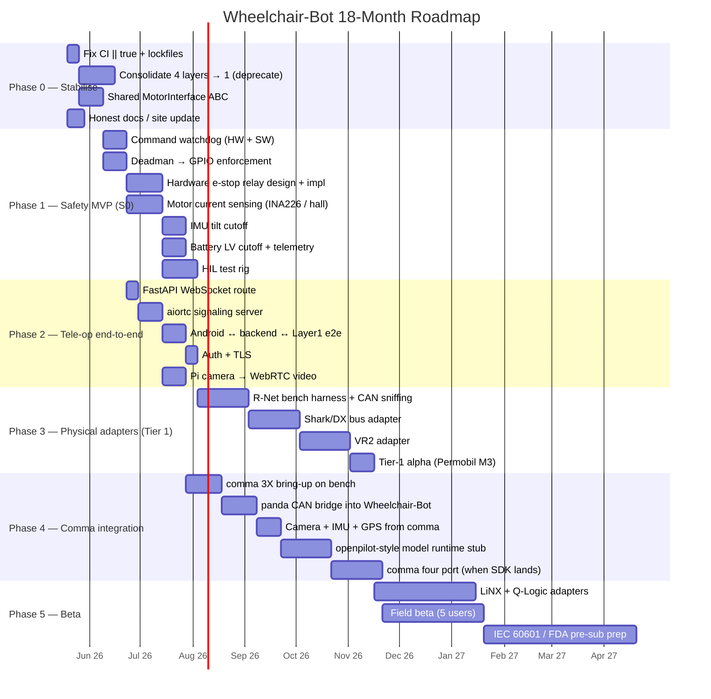
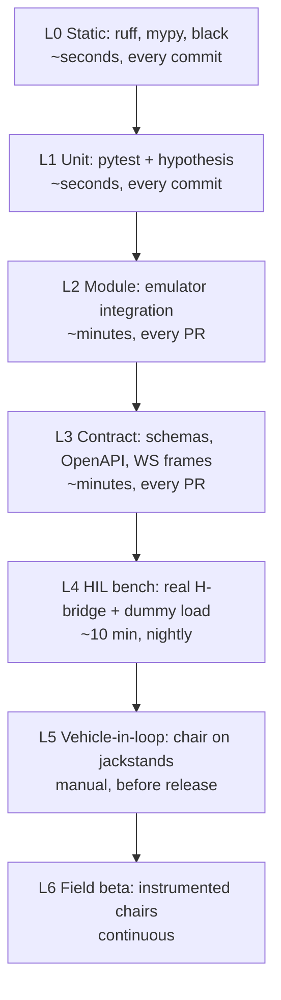
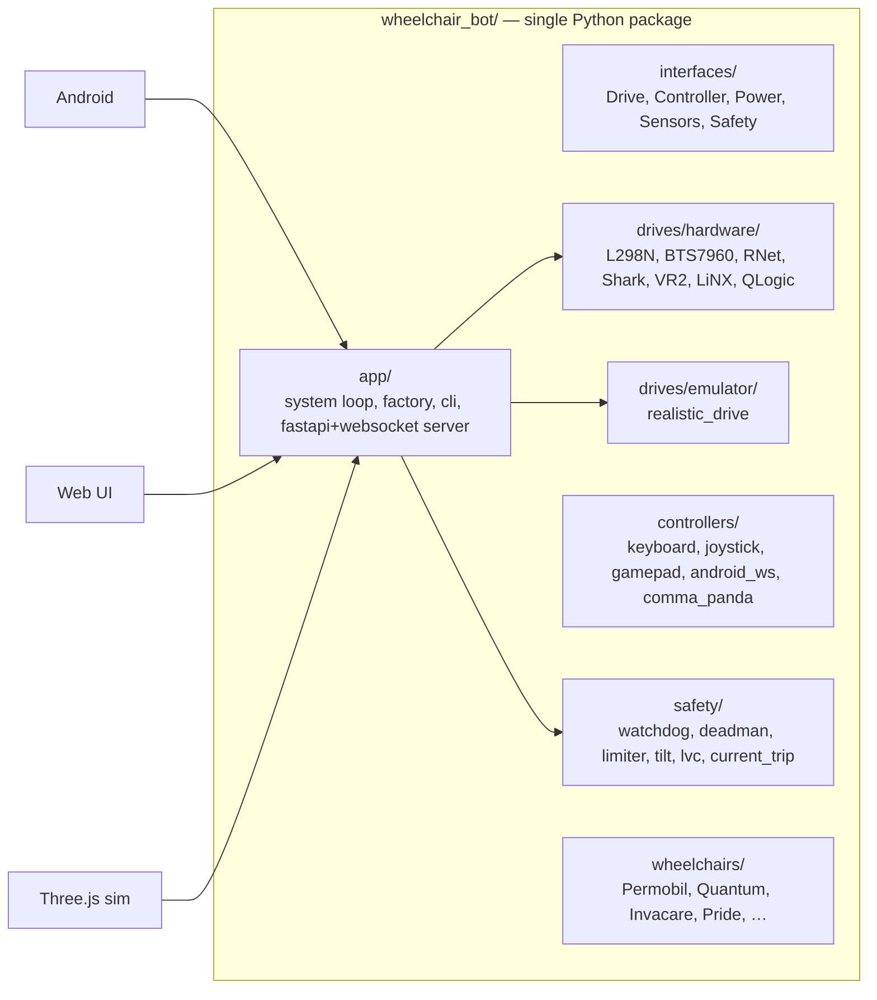
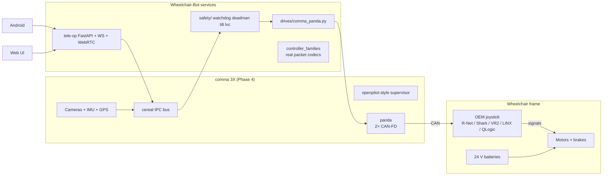
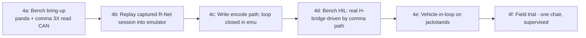

# Wheelchair-Bot — Planning, Gap Analysis & Roadmap

**Companion to:** [architecture.md](architecture.md)
**Date:** 2026-05-18
**Audience:** maintainers, contributors, hardware partners

This document turns the audit findings into (1) a prioritised deficiency backlog, (2) a quarter-by-quarter implementation roadmap, (3) a testing strategy that catches regressions before they reach a wheelchair, and (4) a concrete integration plan for **comma.ai** hardware (comma three / comma 3X / comma four) as the long-term compute + sensor platform.

---

## 1. Gap Analysis Summary

### 1.1 Severity definitions

| Sev | Meaning | SLA to fix |
|-----|---------|-----------|
| **S0 — Safety blocker** | Can injure a user or damage hardware | Before any hardware test |
| **S1 — Functional blocker** | A documented feature is non-functional end-to-end | Before alpha |
| **S2 — Architectural debt** | Maintainability / duplication / dead code | Before beta |
| **S3 — Quality** | Tests, CI, docs, DX | Continuous |
| **S4 — Future capability** | Comma integration, autonomy, ROS bridge | Roadmap |

### 1.2 Deficiency register

| ID | Sev | Area | Gap | Files |
|----|-----|------|-----|-------|
| G-01 | S0 | Safety | No command watchdog — stale commands keep motors running | `wheelchair_bot/system.py`, `wheelchair_controller/motor_driver.py` |
| G-02 | S0 | Safety | No motor current limiting / overload protection | Layer 1 + Layer 2; `models.py` has spec but no enforcement |
| G-03 | S0 | Safety | Deadman timeout sets a flag but does not force GPIO low | `wheelchair_bot/safety/deadman.py` |
| G-04 | S0 | Safety | No hardware-wired e-stop relay; all paths software-only | `wheelchair_controller/motor_driver.py` |
| G-05 | S0 | Safety | No tilt / rollover cutoff (IMU values gathered, never gated) | `src/wheelchair/emulator/sensors.py` |
| G-06 | S0 | Safety | No battery low-voltage cutoff | Layer 3 power model |
| G-07 | S1 | Control path | Android → backend WebSocket has no server handler | `packages/backend/wheelchair_bot/main.py` |
| G-08 | S1 | Control path | WebRTC signaling server is missing entirely | `webrtc.js` (client only) |
| G-09 | S1 | Control path | Emulator (Layer 3) has no production wiring | `src/wheelchair/factory.py` |
| G-10 | S1 | Hardware | Zero physical controller-family adapters (R-Net/Shark/VR2/LiNX/Q-Logic) | `src/wheelchair/controller_families.py` is sim-only |
| G-11 | S1 | Hardware | No CAN transceiver, harness, or pinout documentation | docs/ |
| G-12 | S2 | Arch | Four overlapping Python layouts; nothing imports across | Layers 1/2/3/4 |
| G-13 | S2 | Arch | `wheelchair_bot/` orphaned from runtime | `main.py` imports Layer 1 only |
| G-14 | S2 | Arch | `packages/backend` is a stub with no wheelchair binding | `packages/backend/wheelchair_bot/main.py` |
| G-15 | S2 | Arch | No shared `MotorInterface` ABC; three `set_motor_speeds` impls | L1/L2/L3 |
| G-16 | S3 | CI | `|| true` in workflow suppresses failures | `.github/workflows/ci.yml:91-92` |
| G-17 | S3 | Tests | No HIL (hardware-in-loop) tests | — |
| G-18 | S3 | Tests | No Android instrumentation tests | `android-controller/` |
| G-19 | S3 | Deps | Loose `>=` version pins, no lockfiles, no SBOM | `requirements*.txt`, `pyproject.toml` |
| G-20 | S3 | Docs | Marketing site over-promises vs. code (see arch §13) | `wheelchair-bot.github.io/content.md` |
| G-21 | S3 | Build | Docker production image strips GPIO entirely | `Dockerfile` |
| G-22 | S3 | Code | `keyboard` lib needs root + TTY; broken in containers | `wheelchair_controller/keyboard_control.py` |
| G-23 | S3 | Security | No auth on FastAPI; no TLS on Android WS default | `packages/backend`, Android settings |
| G-24 | S4 | Compute | No support for comma three / 3X / four hardware | — |
| G-25 | S4 | Perception | No camera, depth, or radar fusion despite "tele-robotics" branding | — |
| G-26 | S4 | Autonomy | No path planner, no openpilot reuse, no model runtime | — |

### 1.3 Quantified gap heatmap

| Pillar | Coverage now | Coverage needed for alpha | Gap |
|--------|--------------|---------------------------|-----|
| Emulator fidelity | ~80 % | 90 % | small |
| Hardware abstraction | 0 % | 100 % | **huge** |
| Software safety | ~30 % | 100 % | large |
| Hardware safety | 0 % | 100 % | **huge** |
| Tele-op transport | ~25 % | 100 % | large |
| Android client | ~50 % | 100 % | medium |
| Web UI | ~30 % | 80 % | medium |
| CI / quality | ~40 % | 90 % | medium |
| Docs accuracy | partial / aspirational | accurate | medium |
| Comma hardware integration | 0 % | 100 % | **huge** |

```mermaid
quadrantChart
    title Gap severity × effort
    x-axis Low effort --> High effort
    y-axis Low impact --> High impact
    quadrant-1 Do first
    quadrant-2 Schedule
    quadrant-3 Drop / defer
    quadrant-4 Quick wins
    G-01 Watchdog: [0.25, 0.95]
    G-03 Deadman GPIO: [0.20, 0.92]
    G-16 CI || true: [0.10, 0.55]
    G-07 Backend WS: [0.35, 0.85]
    G-04 HW e-stop: [0.55, 0.95]
    G-02 Current limit: [0.65, 0.92]
    G-10 Physical CAN adapters: [0.85, 0.90]
    G-12 Consolidate layers: [0.70, 0.50]
    G-24 Comma integration: [0.90, 0.85]
    G-25 Perception: [0.85, 0.70]
    G-20 Docs accuracy: [0.20, 0.40]
```

---

## 2. Roadmap



### 2.1 Milestone calendar

| Quarter | Milestone | Exit criteria |
|---------|-----------|---------------|
| 2026 Q2 (now) | **Stabilise** | CI is honest; one canonical Python package; site claims match code |
| 2026 Q3 | **Safety MVP** | All S0 gaps closed on bench rig; HIL passes |
| 2026 Q3 | **Tele-op MVP** | Android joystick drives a real motor through backend with auth |
| 2026 Q4 | **Tier-1 alpha** | One Permobil M3 driven through R-Net adapter under deadman + watchdog |
| 2027 Q1 | **Comma bring-up** | comma 3X reads CAN + camera, forwards to control loop |
| 2027 Q2 | **Beta** | 5 chairs in the field; weekly telemetry; zero unsafe events in 30 days |
| 2027 Q3 | **Regulatory pre-sub** | IEC 60601-1 risk file; pre-submission to FDA / MHRA |

---

## 3. Testing & Verification Strategy

### 3.1 Test pyramid



### 3.2 What each layer covers

| Layer | Tooling | What it catches |
|-------|---------|-----------------|
| L0 | `ruff`, `mypy --strict`, `black --check` | Type errors, lint, formatting |
| L1 | `pytest`, `hypothesis`, `pytest-cov` | Pure-logic bugs in safety limiters, family signal decoders |
| L2 | Emulator (Layer 3) end-to-end | Loop correctness, state transitions, deadman timing |
| L3 | `schemathesis` or `dredd`, JSON-Schema for WS frames | Backend/Android wire-format drift |
| L4 | Pi 5 + L298N + 12 V bench supply + resistive load | GPIO timing, watchdog actually opens PWM, current trip works |
| L5 | Real chair on jackstands, instrumented | Full system minus rider safety |
| L6 | Telemetry to S3 + Grafana | Real-world edge cases |

### 3.3 Required immediate fixes for CI

1. Remove every `|| true` in `.github/workflows/ci.yml`.
2. Add `pip-compile` and check in `requirements.lock`.
3. Add `mypy --strict src/wheelchair` (the cleanest layer).
4. Add a `safety/` test marker — these tests **must** pass on every commit, not just nightly.
5. Add Android instrumentation: `./gradlew connectedAndroidTest` in an emulator job.
6. Add an `npm run build` gate for `packages/frontend`.

### 3.4 HIL test rig — bill of materials

| Item | Purpose | ~ cost |
|------|---------|--------|
| Raspberry Pi 5 + PoE hat | DUT | $120 |
| L298N or BTS7960 H-bridge | Motor driver | $20 |
| 2× 12 V geared motors w/ encoders | Load | $80 |
| INA226 breakouts ×2 | Per-motor current sense | $20 |
| Programmable bench PSU 30 V / 10 A | Battery sim | $200 |
| MCP2515 + TJA1050 CAN board | Talk to real R-Net/Shark on bench | $25 |
| Saleae Logic Pro 8 | PWM + CAN capture | $400 |
| Frame + cabling | — | $100 |
| **Total** | | **~$965** |

### 3.5 Safety-test cases that *must* exist before any wheelchair touches floor

- `test_watchdog_stops_motors_within_100ms_of_command_loss`
- `test_deadman_release_drives_pwm_to_zero_at_gpio_level` (verified with logic analyser)
- `test_overcurrent_trip_within_one_pwm_cycle`
- `test_estop_relay_opens_even_with_python_killed_SIGKILL`
- `test_tilt_cutoff_at_25_deg_sustains_under_vibration`
- `test_battery_lvc_cuts_at_22_5V_for_24V_pack`
- `test_can_bus_fault_reverts_to_local_safe_state`
- `test_wifi_loss_engages_deadman_within_500ms`

---

## 4. Architectural Consolidation Plan

### 4.1 Target shape



### 4.2 Migration steps (Phase 0)

1. **Promote `src/wheelchair/` to canonical** (most mature, best tests).
2. Rename top-level package to `wheelchair_bot` to match repo + PyPI naming, leaving an import shim.
3. Move `wheelchair_bot/wheelchairs/models.py` (Layer 2) into the canonical package.
4. Wrap Layer 1 `MotorDriver` as `drives/hardware/l298n.py` implementing the new `Drive` interface — keep it working.
5. Add `tools/deprecate.py` that fails CI if `from wheelchair_controller` appears in non-test code after a deadline.
6. Delete `packages/shared` (subsumed by interfaces) and `packages/backend` (rewritten under `app/`).
7. Update site/docs to match.

---

## 5. Feature Integration — comma.ai / comma three / comma 3X / comma four

### 5.1 Why comma is the right compute platform

comma's hardware was designed for exactly this problem domain: a sealed automotive-grade compute unit, multi-camera intake, IMU, GPS, CAN bus via the **panda**, and a thermal envelope that holds in a car (so it survives a wheelchair frame). openpilot's process model (cereal IPC, capnp messages, fixed-rate scheduling, watchdog-supervised processes) is a strong base for a safety-critical mobile robot.

| Capability | What comma gives you | What you'd otherwise build |
|------------|----------------------|----------------------------|
| Compute | Snapdragon-class SoC, sealed enclosure | Pi 5 + custom case + thermal |
| Cameras | Dual + driver-cam, time-sync'd | Pi cams + sync code |
| IMU | BMI088 industrial-grade | MPU-6050 dev board |
| GPS | u-blox NEO-M9N | external module |
| CAN | panda (2× CAN-FD + LIN) | MCP2515 boards |
| Software | openpilot scheduler, cereal IPC, params, logger | DIY supervisor |
| Connectivity | LTE, Wi-Fi | dongle |
| OTA | Already shipping | not built |

### 5.2 Hardware matrix

| Device | SoC | CAN | Cameras | Status (2026-05) | Role here |
|--------|-----|-----|---------|------------------|-----------|
| comma three | Snapdragon 845 | via panda over USB | dual road + driver | Shipping, abundant on used market | Phase-4 bench bring-up |
| comma 3X | Snapdragon 845 (refresh, better thermals + screen) | panda over USB | upgraded sensors, IR for night | Current flagship | Primary target for alpha |
| comma four | next-gen (announced; SDK availability assumed by late 2026) | next-gen panda (CAN-FD native) | upgraded ISP, possibly radar | Track for Phase 4e | Drop-in replacement once SDK is open |
| panda (red / black / tres) | STM32 + H7 | 2–3× CAN | — | Shipping | The actual wheelchair-bus bridge |

### 5.3 Integration architecture



The **panda** sits on the wheelchair's CAN bus (or a tapped DCI / LiNX bus via a transceiver board) and either:
- **Adapter mode (Phase 3):** Sniffs the OEM joystick frames and *injects* our own frames when the user is driving via tele-op — exactly like openpilot interposes between an OEM camera and the car ECU.
- **Replacement mode (Phase 5+):** Disconnects the OEM joystick and drives the motor controller directly (only on chairs where this is electrically safe and legally permitted).

### 5.4 Software bridge — `cereal` ↔ Wheelchair-Bot

| cereal topic | Direction | Wheelchair-Bot equivalent |
|--------------|-----------|---------------------------|
| `pandaStates` | comma → wcbot | `safety/can_health` |
| `can` | bi-directional | `drives/comma_panda.py` |
| `carState` | comma → wcbot | `wheelchairs/state.WheelchairState` |
| `carControl` | wcbot → comma | desired `(v_linear, omega)` |
| `driverMonitoringState` | comma → wcbot | tilt + presence + face-on-screen → deadman input |
| `liveLocationKalman` | comma → wcbot | localisation |
| `roadCameraState` / `wideRoadCameraState` | comma → web/Android | tele-op video (replaces aiortc local capture) |

**Implementation outline:**
1. Add `wheelchair_bot/drives/comma_panda.py` — a `Drive` implementation that publishes `sendcan` and subscribes `can`.
2. Move our `controller_families.py` packet codecs from "signal sim" to real encode/decode against capture files. (Capture with `cabana` on the bench rig.)
3. Add `wheelchair_bot/safety/comma_watchdog.py` that subscribes `pandaStates` and engages local safe-stop on heartbeat loss.
4. Use openpilot's `params` and `logger` services as-is (cheap reuse, durable).
5. Run our `tele-op` FastAPI inside a cereal-supervised process so OOM / crash → automatic relaunch and safe-stop in the meantime.

### 5.5 Comma-specific safety model

- **Hardware e-stop (G-04)** lives on a relay in line with the panda's `ignition` and the motor controller's enable line — pulling the relay drops PWM regardless of any software state.
- **Watchdog (G-01)** uses panda's built-in safety mode (`SAFETY_NOOUTPUT` until heartbeat established, `SAFETY_ALLOUTPUT` only when our supervisor heartbeats).
- **Current limit (G-02)** read via INA226 broadcast as a custom cereal topic; trip threshold programmed into a dedicated MCU on the safety board (don't trust Linux for hard real-time).
- **Tilt (G-05)** uses comma's IMU; same threshold logic as openpilot's gyro sanity checks.

### 5.6 Comma three vs 3X vs four — when to switch

| Decision point | Comma three | Comma 3X | Comma four |
|----------------|-------------|----------|------------|
| Use today (2026-05) | Yes — bring-up | **Yes — primary** | Not yet — track SDK |
| Thermal envelope | OK indoors | Better; OK outdoors | Best |
| IR / night | No | Yes | Yes |
| CAN-FD on panda | red panda yes | red panda yes | native expected |
| Migration cost | — | none (same SoC) | recompile + relink against new SDK |
| Recommended switch trigger | — | now | once openpilot master targets it stably |

### 5.7 Comma integration phases



### 5.8 Legal / compliance considerations for the comma path

| Item | Note |
|------|------|
| FDA classification | A powered wheelchair with electronic controls is class II in the US. Adding tele-op compute does not automatically de-class. |
| IEC 60601-1 / -2-1 | Applies to powered wheelchairs. Risk file must include comma compute, panda, and our software. |
| ISO 7176-14 | Specifically covers wheelchair controllers; required for any joystick replacement. |
| Right-to-modify | Many OEMs void warranty on bus tap. Adapter mode (sniff + inject) is the safest legal posture; replacement mode needs OEM partnership. |
| openpilot license | MIT — reuse is fine; attribute. |
| comma device EULA | Check current terms before commercial deployment. |

---

## 6. Implementation Plan — first 90 days

| Week | Owner | Deliverable | Exit test |
|------|-------|-------------|-----------|
| 1 | infra | Remove `|| true`, add `pip-compile`, lockfiles | CI red on a forced failure |
| 1 | docs | Honest README + site update | site claims ↔ code reconciled |
| 2–3 | core | `interfaces/` ABCs; wrap Layer 1 MotorDriver | one shared `Drive` ABC |
| 3 | safety | Software watchdog at control-loop level (G-01) | `test_watchdog_stops_motors_within_100ms` |
| 4 | safety | Deadman → GPIO-level enforcement (G-03) | logic analyser capture in PR |
| 4–5 | backend | FastAPI WebSocket route + auth (G-07, G-23) | Android e2e green |
| 5 | transport | aiortc signaling server (G-08) | Web UI connects to test camera |
| 6 | HIL | Build bench rig (BOM §3.4) | nightly HIL job in CI |
| 6–8 | safety hardware | E-stop relay PCB v1 + INA226 current trip (G-02, G-04) | passes 6 safety tests in §3.5 |
| 8 | arch | Delete `wheelchair_controller/` and `packages/{backend,shared}/` deprecation shims fire | tree shrinks; tests still green |
| 9 | comma | comma 3X on bench, panda reading CAN from spare R-Net joystick | cabana capture committed to repo |
| 10 | comma | `drives/comma_panda.py` encode path; loop closes in emulator | replay test passes |
| 11 | adapter | First real R-Net inject on bench against Permobil controller | controlled motion under deadman |
| 12 | release | **Safety MVP + Tele-op MVP** tagged | demo video; risk file v0.1 |

---

## 7. Decision Log Template (start using immediately)

| ID | Date | Decision | Alternatives | Rationale |
|----|------|----------|--------------|-----------|
| D-001 | 2026-05-18 | Adopt `src/wheelchair/` as canonical package | Keep Layer 1 / fresh rewrite | Most mature; best tested; cleanest interfaces |
| D-002 | 2026-05-18 | Target comma 3X for alpha compute; track comma four | Pi 5, Jetson Orin Nano | Sensor + CAN + supervisor stack already integrated |
| D-003 | 2026-05-18 | Adapter mode (sniff + inject) before replacement mode | Direct motor drive | Lower legal risk; preserves OEM safety circuits |

---

## 8. Risks & open questions

| Risk | Likelihood | Impact | Mitigation |
|------|------------|--------|------------|
| OEM firmware update breaks bus codec | medium | high | Sign captures + nightly replay on every supported chair |
| Comma SDK churn on comma four launch | medium | medium | Pin to LTS branch; keep panda interface stable |
| Battery BMS data is proprietary on newer chairs | high | medium | Use INA226 instead; don't depend on BMS |
| FDA / CE classification re-trigger | medium | very high | Engage regulatory consultant before Phase 5b |
| Volunteer maintainer bandwidth | high | high | Phase 0 should consolidate to one package so onboarding cost drops |
| Insurance for field beta | medium | high | Pilot under research-IRB; participant waivers; restricted ODD |

---

## 9. References inside this repo set

- [architecture.md](architecture.md) — system architecture audit
- [Wheelchair-Bot/docs/architecture.md](Wheelchair-Bot/docs/architecture.md) — original (aspirational) architecture doc
- [Wheelchair-Bot/docs/controller-family-integration.md](Wheelchair-Bot/docs/controller-family-integration.md) — original integration plan
- [Wheelchair-Bot/docs/wheelchair-support.md](Wheelchair-Bot/docs/wheelchair-support.md) — compatibility matrix (81 models)
- [Wheelchair-Bot/.github/workflows/ci.yml](Wheelchair-Bot/.github/workflows/ci.yml) — CI to fix in week 1
- [wheelchair-bot.github.io/content.md](wheelchair-bot.github.io/content.md) — site copy that needs reconciling with reality

---

## 10. TL;DR

1. **Stop shipping marketing claims the code doesn't back.** (Week 1.)
2. **Make CI honest.** (Week 1.)
3. **Pick one package, kill the other three.** (Weeks 2–4.)
4. **Close all S0 safety gaps on a bench rig before any wheelchair test.** (Weeks 3–8.)
5. **Wire the Android joystick to a real motor through a watchdogged FastAPI WS.** (Weeks 4–6.)
6. **Build a HIL rig — every PR runs against it nightly.** (Week 6.)
7. **Bring up comma 3X + panda on the bench as the real CAN bridge.** (Weeks 9–12.)
8. **Move to vehicle-in-loop, then field beta, then regulatory pre-sub.** (2027.)
